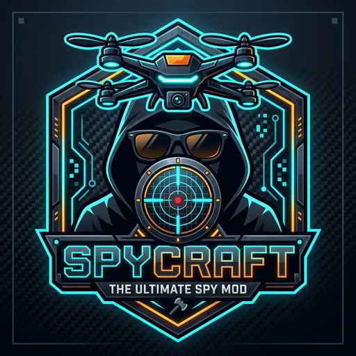

<p align="center">
  
</p>

# 🎮 SpyCraft — Tactical Secret Agent Mod for Minecraft

[](https://fabricmc.net/)
[](https://fabricmc.net/)
[](https://adoptium.net/)
[](https://modrinth.com/mod/spycraft-mod)
[](https://github.com/hdkiller/spycraft/releases)
[](LICENSE)

**SpyCraft** is a high-tech tactical Minecraft mod bringing secret agent gadgets, reconnaissance drones, laser forcefields, night vision, procedural villain skyscraper infiltration bases, and tactical gear to Minecraft 1.21.1! Built with ❤️ by **László & Erik**. Supports both **English (default)** and **Hungarian (Magyar)** native localization.

---

## ⚡ Quickstart: Launch the Game in 1 Command

Open your terminal in `~/Develop/mc/spycraft` and run:

```bash
cd ~/Develop/mc/spycraft
./gradlew runClient
```

Minecraft 1.21.1 will boot up with **SpyCraft** already loaded!

> [!TIP]
> **Using VS Code or Antigravity IDE?**
> Simply open the folder `~/Develop/mc` in VS Code / Antigravity IDE. Press **F5** (or open the *Run & Debug* panel and click **Minecraft Client (Debug)**) to start Minecraft with full code debugging attached!
> Read [`docs/05-ide-and-development-setup.md`](docs/05-ide-and-development-setup.md) for complete details.

---

## 🕵️‍♂️ Tactical Spy Arsenal

All tools are in the **"SpyCraft Tactical Gear"** creative tab:

### 1. 🎯 Mesterlövész Puska (Tactical Sniper Rifle) ([`SniperRifleItem.java`](spycraft/src/main/java/com/hdkiller/spycraft/item/SniperRifleItem.java))
- **Optikai Célkereszt Zoom:** Tartsd nyomva a jobb egérgombot $\rightarrow$ a kamera ráközelít a távoli célpontra nagy nagyítással!
- **Lövés:** Engedd el a gombot $\rightarrow$ dördül a lövés (hangos visszhang és visszarúgás), és egy hiperszonikus füst/szikracsík csapódik be akár **128 blokk** távolságba!
- **Extrém Sebzés:** 28 sebzés (egy lövésből teríti le a legtöbb szörnyet).
- **Csípőlövés:** Guggolva (Shift) + jobb gombbal azonnal lő célzás nélkül.
- **Kém Szemüveg Kombó:** Ha a **Tactical Spy Goggles** rajtad van, a célpontok a falakon át is ragyognak, így sötétben vagy fedezék mögül is láthatod őket!

### 2. ⚡ Lézerfal Erőpajzs Csapda (Laser Forcefield Trap) ([`LaserPylonBlock.java`](spycraft/src/main/java/com/hdkiller/spycraft/block/LaserPylonBlock.java) & [`LaserRemoteItem.java`](spycraft/src/main/java/com/hdkiller/spycraft/item/LaserRemoteItem.java))
- **Lézeroszlopok (Pylons):** Helyezz le legalább 3 oszlopot a védeni kívánt terület körül.
- **Távirányító (Remote):** Kattints sorban az oszlopokra, majd kattints a levegőbe:
  - **BE:** 4 méter magas, szikrázó sci-fi lézer erőpajzs fal jelenik meg az oszlopok között!
  - **ÁTHATOLHATATLAN:** Bárki megpróbál átjutni rajta, az erőpajzs elektromos kisüléssel visszalöki és megrázza! Senki sem tud kijönni vagy behatolni!
  - **KI:** Még egy kattintás a levegőbe $\rightarrow$ a lézerfal azonnal kikapcsol.

### 3. 🥸 Falusi Álcaruha (Villager Spy Disguise) ([`VillagerDisguiseItem.java`](spycraft/src/main/java/com/hdkiller/spycraft/item/VillagerDisguiseItem.java))
- **Falusi Álcamaszk** (Sisak) és **Falusi Álcaköpeny** (Mellvért).
- **Valódi 3D Modellcsere:** Ha felveszed, a játékos modellje azonnal kicserélődik egy **élethű, animált Falusira** (összekulcsolt kezekkel, nagy orral, sétáló animációval és fejmozgással)!
- **Hang:** Álcázva jobb-klikkre a klasszikus *"HRRRMMM!"* falusi hangot adja zöld smaragd szikrákkal!

### 4. 🔫 Tactical Grappling Hook Gun ([`GrapplingHookGunItem.java`](spycraft/src/main/java/com/hdkiller/spycraft/item/GrapplingHookGunItem.java))
- Aim at any ledge or rooftop up to 32 blocks away and right-click.
- Shoots a cable with spark trails and reels Erik up with soft-landing slow-fall protection!

### 5. 📡 Spy Bug & Radar Tracker ([`MobTrackerItem.java`](spycraft/src/main/java/com/hdkiller/spycraft/item/MobTrackerItem.java))
- **Mount on Mobs/Players**: Right-click ANY mob or Dad to plant a live bug (glows through walls for 10 min).
- **Plant GPS Beacon on Blocks**: Right-click ANY block to plant a permanent beacon.
- **Sonar Ping**: Right-click in the air anytime to ping distance, elevation, and compass heading.

### 6. 🕶️ Tactical Spy Goggles ([`SpyGogglesItem.java`](spycraft/src/main/java/com/hdkiller/spycraft/item/SpyGogglesItem.java))
- **Night Vision**: Instant, permanent clear vision in dark caves and at night.
- **Sky-High Beacon Pillar**: Projects a towering **96-block tall glowing light pillar** straight up into the sky, visible over mountains from up to 256 meters away!
- **Live Action-Bar HUD**: `[SPY HUD | 📍 Base: 24m | 📡 Target: 12m | 💣 C4: 2 [MEGA 3x]]`.

### 7. 🧭 GPS Waypoint Navigator Visor ([`GpsNavigatorGogglesItem.java`](spycraft/src/main/java/com/hdkiller/spycraft/item/GpsNavigatorGogglesItem.java))
- **Floating 3D Guidance Arrows**: Projects glowing 3D arrows directly in the air in front of your eyes pointing the exact way towards your beacon or target!
- **Dynamic Relative HUD**: `⬆ [EGYENESEN ELŐRE]`, `➡ [FORDULJ JOBBRA]`, `⬇ [FORDULJ MEG!]`, stb.

### 8. 🧨 Tactical C4 Canister & Remote Detonator ([`C4Block.java`](spycraft/src/main/java/com/hdkiller/spycraft/block/C4Block.java) & [`RemoteDetonatorItem.java`](spycraft/src/main/java/com/hdkiller/spycraft/item/RemoteDetonatorItem.java))
- Sleek 3D **cylindrical tube canister** with 3 LED indicators.
- **3 Robbanási Fokozat**: 1x Alap (4.5x), 2x Dupla (9.0x), 3x MEGA (18.0x óriási kráter)!
- Right-click detonator in the air to trigger simultaneous breach!

### 9. 🛸 Felderítő Drón (Tactical Recon Drone) ([`ReconDroneItem.java`](spycraft/src/main/java/com/hdkiller/spycraft/item/ReconDroneItem.java))
- **Irányítható repülés (60s akku)**: Jobb klikk és a játékos átveszi a drón irányítását szabad 3D repüléssel, propellerekkel és LED fényekkel.
- **Speciális Drón Műszerfal GUI**: A játékos normál inventory hotbarja és keze teljesen elrejtőzik, helyette a képernyő alján megjelenik a 4-gombos **Drón Vezérlő Dokk**:
  - `[1: 🎯 LÉZER JELÖLŐ]` — Vörös lézersugár & 96 blokk magas felhőkig érő Beacon fénysugár a célpontra.
  - `[2: 💤 ALTATÓ LÖVEDÉK (5/5)]` — Pneumatikus kábító lövedék, a célpont elalszik (15 másodpercre mozdulatlanul megdermed, békés Zzz kotta hangjegyek lebegnek a feje felett).
  - `[3: 💥 KAMIKAZE CSAPÁS]` — Taktikai zuhanás & robbanás (yield 4.0), a pilóta azonnal biztonságban visszatér a bázisra.
  - `[4: 🏠 BÁZIS VISSZATÉRÉS]` — Biztonságos visszatérés a kiindulópontra.
- **Akcióválasztás**: Az `1`, `2`, `3`, `4` számbillentyűkkel vagy egérgörgővel választhatsz a 4 funkció közül, majd a **Jobb klikk** azonnal végrehajtja! Nem tudsz véletlenül fegyvert vagy sniper puskát elővenni.
- **Töltés & Újratöltés**:
  - **Gyors-töltés**: Guggolva Jobb klikk Redstone-nal a kézben azonnal 100%-ra (60mp) tölti az akkumulátort és újratölti az 5/5 altató lövedéket!
  - **Csepptöltés**: Ha a drón a hátizsákban pihen, magától is lassan újratöltődik.
- **Radar & Szkenner**: Folyamatosan pásztázza a környező mobokat (32m hatótáv), Glowing körvonalat ad nekik és szinkronizál a Trackerekkel és a Navigációs Szemüvegekkel!

### 10. 🔊 Hangcsapda (Sonic Decoy Sound Trap) ([`SoundTrapBlock.java`](spycraft/src/main/java/com/hdkiller/spycraft/block/SoundTrapBlock.java))
- **Creeper sziszegés hang**: 3 másodpercenként élethű, félelmetes Creeper sziszegést (`CREEPER_PRIMED`) bocsát ki 2.5x-es hangerővel (akár 40 blokk távolságig hallatszik)!
- **Mob vonzás & csalizás**: 32 méteres körzetben minden ellenséges és békés mobot (Zombik, Csontvázak, Creeper-ek, Pókok, stb.) közvetlenül magához vonz; a mobok odasétálnak és gyanakvóan nézik a csapdát!
- **Játékos megtévesztés**: Barlangban vagy bázison elrejtve a játékosok a sziszegést hallva pánikszerűen keresni kezdik a nem létező Creepert.
- **Kiütésre megszűnik**: Ha kiütöd vagy elbontod a blokkot, a sziszegés azonnal elhallgat, és a mobok elhagyják a helyszínt. Kézzel jobb klikkelve csendes készenléti módba is kapcsolható.

### 11. 🪂 Taktikai Ejtőernyős Hátizsák (Tactical Parachute Backpack) ([`ParachuteBackpackItem.java`](spycraft/src/main/java/com/hdkiller/spycraft/item/ParachuteBackpackItem.java))
- **Hátra véve (Mellvért slot):** Magasból ugráskor a zuhanást azonnal érzékeli és magától kinyílik, vagy ugrás közben a Guggolás (Sneak) gombbal kézzel is nyitható!
- **Kézben tartva (Inventory):** Ha a kezedben van és leugrasz egy magas toronyból, jobb-klikkre (vagy használatra) vésznyitásként azonnal kinyílik!
- **Irányítható siklás:** A nézésed irányában siklik finoman, 100%-ban nullázza az esési sebzést, és a talaj érintésekor automatikusan összecsukódik.

### 12. 🧤 Mágneses Mászókesztyű (Magnetic Climbing Gloves) ([`ClimbingGlovesItem.java`](spycraft/src/main/java/com/hdkiller/spycraft/item/ClimbingGlovesItem.java))
- **Falmászás:** Kézben tartva függőleges felületeken (akár sima üveg, kő vagy vasfalakon) is fel tudsz mászni.
- **Tapadás:** Guggolás (Sneak / Shift) gombbal megállsz a falon egy helyben pihenni vagy lőni.

### 13. 🥽 Hőkamera Szemüveg (Thermal Vision Goggles) ([`ThermalGogglesItem.java`](spycraft/src/main/java/com/hdkiller/spycraft/item/ThermalGogglesItem.java))
- **Látás a falakon át:** 32 méteres körzetben ragyogó kontúrt ad minden élőlénynek, zombinak, őrnek és játékosnak, még a vastag falak mögött is!

### 14. 💤 Altató Nyílpuska (Tranquilizer Dart Gun) ([`TranquilizerGunItem.java`](spycraft/src/main/java/com/hdkiller/spycraft/item/TranquilizerGunItem.java))
- **Csendes kábítás:** Pneumatikus altató lövedékeket lő ki hangtalanul. Eltalálva a célpont elalszik (15 másodpercig mozgásképtelenné válik és elfelejti az agrót).

### 15. 👥 Hologram Projektor (Holographic Decoy) ([`HologramProjectorItem.java`](spycraft/src/main/java/com/hdkiller/spycraft/item/HologramProjectorItem.java))
- **Megtévesztő klón:** Jobb-klikk a talajra egy sugárzó, élethű hologram klónt vetít ki, ami magára vonzza a közeli szörnyek és őrök figyelmét 25 másodpercre.

### 16. 💨 Taktikai Füstgránát (Tactical Smoke Grenade) ([`SmokeGrenadeItem.java`](spycraft/src/main/java/com/hdkiller/spycraft/item/SmokeGrenadeItem.java))
- **Füstfüggöny:** Eldobva sűrű, látványos füstfelhőt képez 12 másodpercre, ami megvakítja az ellenségeket és láthatatlanságot biztosít a behatolónak.

### 17. 🏢 Küldetés Jeladó Csomag (Mission Deployer Beacon) ([`MissionBeaconItem.java`](spycraft/src/main/java/com/hdkiller/spycraft/item/MissionBeaconItem.java))
- **Procedurális kémbázis felhőkarcoló:** Jobb-klikk a talajra felépíti a 96 emeletes gonosztevő felhőkarcolót mélygarázzsal, lifttel, őrökkel és széfekkel!

---

## 🛠️ Common Commands

Run these inside `~/Develop/mc/spycraft`:

| Command | What it Does |
| :--- | :--- |
| `./gradlew runClient` | Boots up Minecraft with SpyCraft for live testing |
| `./gradlew test` | Runs JUnit 5 automated test suite |
| `./gradlew build` | Compiles into `build/libs/spycraft-1.0.0.jar` |
| `./gradlew runServer` | Starts dedicated multiplayer test server |
| `python3 tools/asset-harness/server.py` | Starts Asset Studio web harness at `http://127.0.0.1:8088` |
| `python3 tools/asset-harness/cli_apply.py apply-preset specops` | Applies SpecOps tactical texture preset |

---

## 🎨 Asset Studio & Texture Variants

SpyCraft includes a dedicated interactive web harness and CLI tool to preview, compare, inspect in 3D, and switch texture variants for items and blocks:
- **Web UI:** [`http://127.0.0.1:8088`](http://127.0.0.1:8088) (run `python3 spycraft/tools/asset-harness/server.py`)
- **Themes Available:** SpecOps Tactical, Cyberpunk Neon, Steampunk / Vanilla Friendly, Baseline Prototype.
- **Documentation:** See [`docs/06-asset-harness.md`](docs/06-asset-harness.md) for full instructions.

